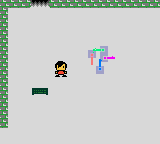

# PxlJam 2018

## About

This is a game for the Game Boy Color made by Rupert Steel and Sanjay Govind at the 2018 PlxJam game jam.

We decided on making a game for the Game Boy Color as a challenge.

The theme of this jam was 'To the point'

This is only a very basic game with one puzzle level. We were planning on implementing more, but due to time constraints and not wanting to go without sleep we weren't able to.

## Timeline

### Day 1

To increase the difficulty of this challenge, we also decided to only lookup information for developing Game Boy Color games less than 3 hours before starting the jam.

When the jam started we spent about an hour and a half trying to think of ideas of a game to match the theme. We could think of many ideas, but none of our initial ones could easily be implemented on a Game Boy Color.

So instead of wasting more time, we decided just to start implementing something and think of the theme later on.  
At this point we implemented some sprite rendering and managed to get CMake to generate makefiles for the GDBK devkit, but we still didn't have a theme, so we decided to get some dinner and think out what out game was going to be.

We came back with 2 main ideas for out game:
 - Achieving a specific point score.
 - Having the rooms rotate around a point.

At this point we finished up for the day.

### Day 2

The next day we found a simple game engine for the Game Boy and Game Boy Color called [ZGB](https://github.com/Zal0/ZGB). We decided that switching to this will save us time, and it did.

The problem is that ZGB is still missing several basic features such as tile meta data, setup parameters to objects, etc.

We then spent the next day and a bit implementing the rest of the features needed to implement our game such as tile meta data and a status bar.

### Day 3

Near the end we decided to drop the idea of achieving a specific point score as we didn't have enough time to implement a fun system for this mechanic.

This left us we having the rooms involve points, I had already though of a set of puzzles involving lasers aiming towards a point and had drawn sprites for these lasers.  
But due to only really having about 2 hours to implement these levels, we only managed to get one puzzle level in before time ran out.

If we had started with ZGB, we probably would have implemented a set of puzzle rooms and possibly of have started implementing the second set.
